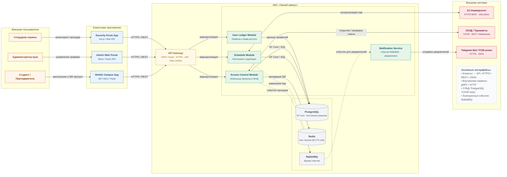

C4 Container Diagram (АИС «Умный кампус» • Level 2)

```mermaid
flowchart LR
    classDef actor fill:#fff5eb,stroke:#e69138,stroke-width:1.5px,color:#783f04
    classDef client fill:#ebf3fa,stroke:#5b9bd5,stroke-width:1.5px,color:#1f4e79
    classDef gateway fill:#fff8e7,stroke:#d6b656,stroke-width:1.5px,color:#7f6000
    classDef core fill:#e6f4ea,stroke:#57bb8a,stroke-width:1.5px,color:#134f5c
    classDef db fill:#f3f4f6,stroke:#9ca3af,stroke-width:1.5px,color:#374151
    classDef ext fill:#fce8e6,stroke:#e06666,stroke-width:1.5px,color:#741b47
    classDef info fill:#f9fafb,stroke:#d1d5db,stroke-width:1px,color:#4b5563,text-align:left

    subgraph Users ["Внешние пользователи"]
        direction TB
        U_Student["<b>Студент / Преподаватель</b>"]:::actor
        U_Admin["<b>Администратор вуза</b>"]:::actor
        U_Guard["<b>Сотрудник охраны</b>"]:::actor
    end

    subgraph Clients ["Клиентские приложения"]
        direction TB
        C_Mobile["<b>Mobile Campus App</b><br/><small>.NET MAUI / Flutter</small>"]:::client
        C_AdminWeb["<b>Admin Web Portal</b><br/><small>Blazor / React SPA</small>"]:::client
        C_GuardWeb["<b>Security Kiosk App</b><br/><small>Vue.js / Web SPA</small>"]:::client
    end

    subgraph System ["АИС «Умный кампус»"]
        direction TB
        GW["<b>API Gateway</b><br/><small>YARP / Ocelot · HTTPS · JWT · Rate Limiting</small>"]:::gateway

        subgraph Services [" "]
            direction LR
            S_Sched["<b>Schedule Module</b><br/><small>Расписание и аудитории</small>"]:::core
            S_Access["<b>Access Control Module</b><br/><small>Мобильные пропуска и СКУД</small>"]:::core
            S_User["<b>User Ledger Module</b><br/><small>Профили и права доступа</small>"]:::core
            S_Notif["<b>Notification Service</b><br/><small>События RabbitMQ · уведомления</small>"]:::core
        end

        subgraph Storage [" "]
            direction LR
            DB_PG[("<b>PostgreSQL</b><br/><small>EF Core · постоянное хранение</small>")]:::db
            DB_Redis[("<b>Redis</b><br/><small>Кэш токенов QR (TTL 60s)</small>")]:::db
            MQ_Rabbit["<b>RabbitMQ</b><br/><small>Брокер событий</small>"]:::db
        end
    end

    subgraph Externals ["Внешние системы"]
        direction TB
        E_1C["<b>1С:Университет</b><br/><small>HTTPS REST · XML/JSON</small>"]:::ext
        E_SKUD["<b>СКУД / Турникеты</b><br/><small>TCP/IP · REST / WebSockets</small>"]:::ext
        E_TG["<b>Telegram Bot / FCM-шлюз</b><br/><small>HTTPS · JSON</small>"]:::ext
        
        InfoBox["<b>Основные интерфейсы:</b><br/>• Клиенты → API: HTTPS / REST / JSON<br/>• Внутренние сервисы: gRPC / HTTP<br/>• СУБД: PostgreSQL TCP/IP 5432<br/>• Асинхронные события: RabbitMQ"]:::info
    end

    U_Student -->|"расписание и QR-пропуск"| C_Mobile
    U_Admin -->|"управление правами"| C_AdminWeb
    U_Guard -->|"мониторинг проходов"| C_GuardWeb

    C_Mobile -->|"HTTPS / REST"| GW
    C_AdminWeb -->|"HTTPS / REST"| GW
    C_GuardWeb -->|"HTTPS / REST"| GW

    GW -->|"маршрутизация"| S_Sched
    GW -->|"маршрутизация"| S_Access
    GW -->|"маршрутизация"| S_User

    S_Sched -->|"EF Core / SQL"| DB_PG
    S_Access -->|"EF Core / SQL"| DB_PG
    S_User -->|"данные профилей"| DB_PG
    S_Access -->|"валидация QR"| DB_Redis
    S_Access -.->|"события проходов"| MQ_Rabbit
    S_Sched -.->|"изменения пар"| MQ_Rabbit
    MQ_Rabbit -.->|"события для уведомлений"| S_Notif

    S_Sched <-->|"синхронизация пар"| E_1C
    S_Access <-->|"открытие / проверка ключа"| E_SKUD
    S_Notif -->|"отправка уведомлений"| E_TG
```
