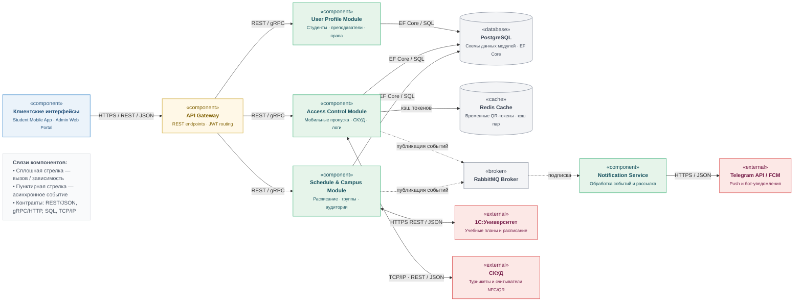

UML Component Diagram (Компонентная структура АИС «Умный кампус»)

```mermaid
flowchart LR
    classDef client fill:#ebf3fa,stroke:#5b9bd5,stroke-width:1.5px,color:#1f4e79
    classDef gateway fill:#fff8e7,stroke:#d6b656,stroke-width:1.5px,color:#7f6000
    classDef core fill:#e6f4ea,stroke:#57bb8a,stroke-width:1.5px,color:#134f5c
    classDef db fill:#f3f4f6,stroke:#9ca3af,stroke-width:1.5px,color:#374151
    classDef ext fill:#fce8e6,stroke:#e06666,stroke-width:1.5px,color:#741b47
    classDef legend fill:#f9fafb,stroke:#d1d5db,stroke-width:1px,color:#4b5563,text-align:left

    ClientUI["«component»<br/><b>Клиентские интерфейсы</b><br/><small>Student Mobile App · Admin Web Portal</small>"]:::client
    Gateway["«component»<br/><b>API Gateway</b><br/><small>REST endpoints · JWT routing</small>"]:::gateway

    ScheduleMod["«component»<br/><b>Schedule & Campus Module</b><br/><small>Расписание · группы · аудитории</small>"]:::core
    AccessMod["«component»<br/><b>Access Control Module</b><br/><small>Мобильные пропуска · СКУД · логи</small>"]:::core
    UserMod["«component»<br/><b>User Profile Module</b><br/><small>Студенты · преподаватели · права</small>"]:::core
    NotifyMod["«component»<br/><b>Notification Service</b><br/><small>Обработка событий и рассылка</small>"]:::core

    Postgres[("«database»<br/><b>PostgreSQL</b><br/><small>Схемы данных модулей · EF Core</small>")]:::db
    Redis[("«cache»<br/><b>Redis Cache</b><br/><small>Временные QR-токены · кэш пар</small>")]:::db
    Rabbit["«broker»<br/><b>RabbitMQ Broker</b>"]:::db

    Ext1C["«external»<br/><b>1С:Университет</b><br/><small>Учебные планы и расписание</small>"]:::ext
    ExtSKUD["«external»<br/><b>СКУД</b><br/><small>Турникеты и считыватели NFC/QR</small>"]:::ext
    ExtPush["«external»<br/><b>Telegram API / FCM</b><br/><small>Push и бот-уведомления</small>"]:::ext

    ClientUI -->|"HTTPS / REST / JSON"| Gateway
    Gateway -->|"REST / gRPC"| ScheduleMod
    Gateway -->|"REST / gRPC"| AccessMod
    Gateway -->|"REST / gRPC"| UserMod

    ScheduleMod <-->|"HTTPS REST / JSON"| Ext1C
    AccessMod <-->|"TCP/IP · REST / JSON"| ExtSKUD
    NotifyMod -->|"HTTPS / JSON"| ExtPush

    ScheduleMod -->|"EF Core / SQL"| Postgres
    AccessMod -->|"EF Core / SQL"| Postgres
    UserMod -->|"EF Core / SQL"| Postgres

    AccessMod -->|"кэш токенов"| Redis
    ScheduleMod -.->|"публикация событий"| Rabbit
    AccessMod -.->|"публикация событий"| Rabbit
    Rabbit -.->|"подписка"| NotifyMod

    Legend["<b>Связи компонентов:</b><br/>• Сплошная стрелка — вызов / зависимость<br/>• Пунктирная стрелка — асинхронное событие<br/>• Контракты: REST/JSON, gRPC/HTTP, SQL, TCP/IP"]:::legend
```
